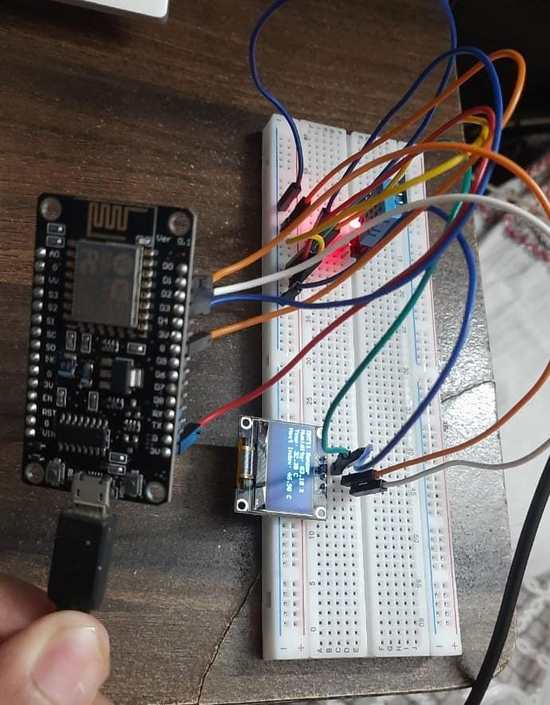
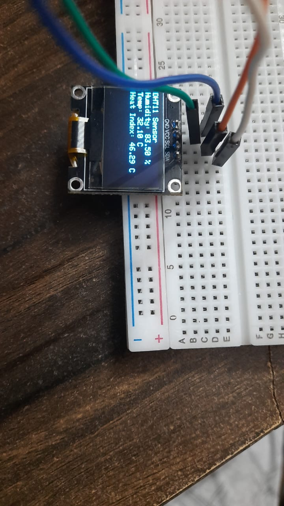
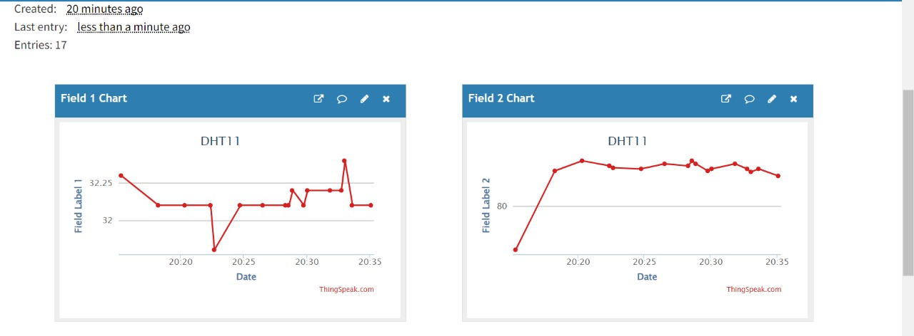

# DHT11 ThinkSpeak Server Temperature & Humidity Reading

### Here by Using NodeMCUESP8266 & DHT11 Tempearature & Humidity based Sensor &  Cloud Service Like ThinkSpeak we can Read the Tempearture & humidity Collected by the DHT 11  & show it in the ThinkSpeak Console.

## Working Circuit :

## OLED Screen Display  :

## Think Speak Console :

<B> After 17 Reading
<B> Field 1 is Temperature 
<B> Field 2 is Temperature 

## Components Required :

<ul>
<li>NodeMCU ESP8266</li>
<li>DHT11</li>
<li>Wire (Male-Male,Male-Female)</li>
<li>Power Supply(From Comp)</li>
<li>Thinkspeak Account</li>
<li> USB Cabel </li>
</ul>
